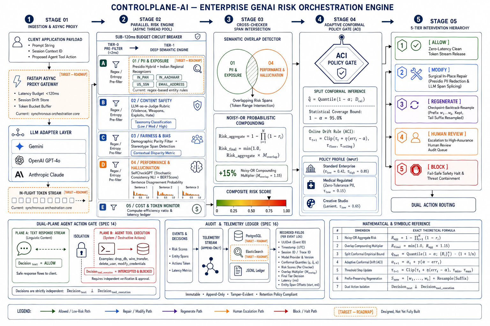

# ControlPlane-AI

[](https://www.python.org/downloads/release/python-3110/)
[](https://fastapi.tiangolo.com/)
[](https://opensource.org/licenses/MIT)
[]()
[]()

A model-agnostic runtime governance middleware for enterprise GenAI risk orchestration.

---

## 🧭 Overview

Modern enterprises deploy generative AI across diverse, concurrent business functions—from public customer chatbots to internal developer copilots and regulated clinical/financial assistants. Each use case operates under radically different risk tolerances and latency constraints. Today, organizations face a critical blind spot: hallucinations, toxic outputs, demographic bias, PII exfiltration, and unauthorized agentic tool actions are discovered **after** the user or downstream workflow has already consumed them.

**ControlPlane-AI** solves this by inserting a runtime governance and evaluation plane directly between the calling application and foundation LLMs. Rather than acting as a rigid, binary pass/fail filter, ControlPlane-AI is a model-agnostic runtime control layer that continuously evaluates an AI response for performance, cost, and responsibility risks during generation, and dynamically decides whether to allow, locally modify, regenerate, or escalate to a human.

By grounding its decisions in **Conformal Prediction** and **Adaptive Conformal Inference (ACI)**, ControlPlane-AI provides mathematical coverage guarantees ($1 - \alpha = 95\%$) over runtime outputs, moving enterprise AI governance from ungrounded heuristics into provable statistical reliability.

---

## 🚀 Live Demo

- Explore the deployed web console: **[Live Demo](YOUR_DEPLOYED_URL_HERE)**
- *No deployment yet? See [Installation & Running Locally](#-installation--running-locally) below to run the full dashboard locally in under 5 minutes.*

[](YOUR_VIDEO_URL_HERE)

---

## 🏗️ Architecture


*Figure 1: High-level 5-stage orchestration pipeline: Ingestion & Streaming Proxy → Parallel 2-Tier Risk Engine → Semantic Overlap & Noisy-OR Compounding → Adaptive Conformal Policy Gate → 5-Tier Intervention Hierarchy.*

> [!NOTE]
> **Legend & Scope Callout**: Components and infrastructure marked as `[Target — Roadmap]` in architectural specifications (such as distributed PostgreSQL persistence, Kubernetes horizontal worker pools, and streaming `TaskGroup` proxying) represent production-grade target designs. The active prototype implements local append-only JSONL logging, threaded concurrency pools, and direct FastAPI proxy interception, as detailed in the [Roadmap & Known Limitations](#-roadmap--known-limitations) section.

---

## 🧩 Key Features

All implemented capabilities match the authoritative specification records:

- **Model-Agnostic LLM Adapter Layer (`SPEC_01 / SPEC_04`)**: Abstract streaming and synchronous interface supporting Google Gemini (`gemini-3.6-flash`) via the modern `google-genai` SDK, alongside a deterministic `MockAdapter` for offline and test execution.
- **Microsecond 2-Tier Risk Gating (`SPEC_02`)**: Fast Tier-0 regex/heuristic pre-filters that execute in $<2\text{ms}$, bypassing heavy Tier-1 semantic models on clean text to preserve latency budgets.
- **Hybrid PII & Regional Compliance (`SPEC_02 / Indian PII`)**: Detection and masking for global identifiers (US SSN, Emails, Credit Cards) plus regional financial entities (Indian PAN and 12-digit Aadhaar UIDAI) via Microsoft Presidio regex recognizers.
- **LLM-as-a-Judge Safety & Bias Rubrics (`SPEC_03`)**: Structured JSON taxonomy evaluators checking for illicit planning, violence, hate speech, and demographic stereotyping.
- **SelfCheckGPT Hallucination Detection (`SPEC_01`)**: Zero-resource black-box hallucination scoring evaluating stochastic sample agreement using DeBERTa-v3 NLI and BERTScore embeddings.
- **Consequence-Aware Latency Budgets & Circuit Breakers (`SPEC_11`)**: Automatic checker execution timeouts based on use-case risk tiers, gracefully salvaging completed checks without stalling user streams.
- **Cross-Checker Semantic Overlap Detection (`SPEC_12`)**: Token-level Intersection-over-Union (`char_iou`) and `sentence-transformers` (`all-MiniLM-L6-v2`) clustering to catch co-occurring risks and compound penalties via Noisy-OR probability aggregation.
- **Adaptive Conformal Inference (ACI) Policy Gate (`SPEC_03 / SPEC_13`)**: Dynamic quantile drift tracking ($\tau_{\text{low}}, \tau_{\text{high}}$) that self-calibrates over human review queues to mathematically preserve error rate bounds under data drift.
- **Surgical Span Repair (`SPEC_08 / SPEC_09`)**: In-place regex and LLM span splicing that redacts or rewrites isolated violations without discarding the surrounding valid context (`MODIFY`).
- **Checkpoint-Backtrack-Resample Engine (`SPEC_09`)**: Prefix-preserving regeneration that locks valid tokens $w_1 \dots w_k$ and resamples only contaminated suffixes.
- **Dual-Plane Agentic Action Gate (`SPEC_14`)**: Independent interception layer that separates conversational text responses (`ALLOW`) from destructive agent tool executions (`BLOCK`), preventing unauthorized tool execution.
- **Audit & Human Review Escalation Queues (`SPEC_16`)**: Structured append-only logging to `audit_log.jsonl`, routing high-uncertainty samples to `human_review_queue.jsonl`.

---

## 🛠️ Tech Stack

| Architectural Layer | Production Technology |
| :--- | :--- |
| **Runtime & Language** | Python 3.11 |
| **API Framework & Server** | FastAPI, Uvicorn, Pydantic v2 |
| **LLM Provider Integration** | Google GenAI SDK (`google-genai` / Gemini 3.6 Flash), Deterministic Mock Adapter |
| **NLP & Semantic Embeddings**| `sentence-transformers` (`all-MiniLM-L6-v2`), Spacy, Microsoft Presidio Analyzer |
| **Hallucination Evaluation** | `selfcheckgpt` (DeBERTa-v3 NLI, BERTScore) |
| **Concurrency Model** | Asynchronous `asyncio` event loop + `ThreadPoolExecutor` worker pool |
| **User Interface** | Vanilla HTML5, Modern CSS (Swiss Command Room Editorial & Glassmorphism), Vanilla JavaScript |
| **Data Storage (Prototype)** | Local append-only `.jsonl` audit files (`data/audit_log.jsonl`, `data/metrics_log.jsonl`) |

---

## ⚙️ Requirements

- **Python**: Version `3.11` or higher
- **Package Manager**: `pip` (or `uv`)
- **Version Control**: `git`
- **LLM Credentials**: A valid Google Gemini API key (`GEMINI_API_KEY`) set in `.env` (or run offline with the built-in `MockAdapter` without an API key).
- No special requirements beyond the above.

---

## 💻 Installation & Running Locally

### macOS (zsh / bash)

```bash
# 1. Clone the repository
git clone https://github.com/Sagnik120/controlplane-ai.git
cd controlplane-ai

# 2. Create and activate a virtual environment
python3.11 -m venv .venv
source .venv/bin/activate

# 3. Install dependencies
pip install --upgrade pip
pip install -r requirements.txt
python -m spacy download en_core_web_sm

# 4. Set environment variables (create .env or export directly)
cp .env.example .env
export GEMINI_API_KEY="your-gemini-api-key-here"

# 5. Run the FastAPI server
uvicorn src.api.main:app --reload --port 8000

# 6. Open the dashboard in browser
open http://localhost:8000
```

### Linux (Ubuntu / Debian / bash)

```bash
# 1. Clone the repository
git clone https://github.com/Sagnik120/controlplane-ai.git
cd controlplane-ai

# 2. Create and activate a virtual environment
python3 -m venv .venv
source .venv/bin/activate

# 3. Install dependencies
pip install --upgrade pip
pip install -r requirements.txt
python -m spacy download en_core_web_sm

# 4. Set environment variables
cp .env.example .env
export GEMINI_API_KEY="your-gemini-api-key-here"

# 5. Run the FastAPI server
uvicorn src.api.main:app --reload --port 8000

# 6. Open the dashboard in browser
xdg-open http://localhost:8000
```

### Windows (PowerShell)

```powershell
# 1. Clone the repository
git clone https://github.com/Sagnik120/controlplane-ai.git
cd controlplane-ai

# 2. Create and activate a virtual environment
python -m venv .venv
.venv\Scripts\Activate.ps1

# 3. Install dependencies
pip install --upgrade pip
pip install -r requirements.txt
python -m spacy download en_core_web_sm

# 4. Set environment variables
Copy-Item .env.example .env
$env:GEMINI_API_KEY="your-gemini-api-key-here"

# 5. Run the FastAPI server
uvicorn src.api.main:app --reload --port 8000

# 6. Open the dashboard in browser
Start-Process "http://localhost:8000"
```

---

## 🎛️ Configuration

ControlPlane-AI provides declarative policy configuration through [`configs/use_case_policies.yaml`](./configs/use_case_policies.yaml):

```yaml
use_cases:
  customer_support_chatbot:
    name: "Customer Support Chatbot"
    description: "Balanced risk tolerance for conversational support."
    max_overall_risk: 0.80
    conformal_bounds:
      tau_low: 0.42
      tau_high: 0.85
    block_on_overlap: true

  medical_assistant:
    name: "Medical Assistant"
    description: "Strict zero-tolerance for PII exposure with auto-redaction."
    max_overall_risk: 0.85
    conformal_bounds:
      tau_low: 0.15
      tau_high: 0.60
    checker_thresholds:
      pii: 0.00
    redact_pii: true
```

- **Policy Schema Reference**: See [`src/policy/schemas.py`](./src/policy/schemas.py) for the complete Pydantic data model and validation constraints.
- **Offline / Deterministic Testing**: Set `GEMINI_API_KEY=""` or omit the key in `.env` to automatically initialize the internal `MockAdapter` without consuming live API tokens.

---

## 📊 Metrics & Trust Dashboard

In addition to the interactive runtime testbench, ControlPlane-AI includes an auditable **Trust & Calibration Ledger** accessible at `/metrics.html`:

- **Empirical vs. Guaranteed Conformal Coverage**: Real-time statistical verification of output safety ($95\%$ theoretical bound vs empirical test coverage).
- **False Positive / Negative Rate Tracking**: Measures over-blocking and under-flagging ratios across defined use-case policies.
- **Action Tier Distribution**: Visual breakdown of total requests resolved via `ALLOW`, `MODIFY`, `REGENERATE`, `HUMAN`, and `BLOCK`.
- **API Endpoint**: Access pre-aggregated statistical summaries programmatically at `/api/metrics`.

---

## 🗺️ Roadmap & Known Limitations

Consistent with our codebase analysis and engineering design reviews, we maintain clear boundaries regarding current prototype constraints and planned production milestones:

1. **Synchronous Outer Loop (`src/orchestrator/pipeline.py`)**: While individual risk checkers evaluate in parallel via worker thread pools, the outer pipeline orchestration executes synchronously. Transitioning to a native asynchronous `TaskGroup` proxy loop is planned for high-throughput horizontal proxy deployments.
2. **Local File Persistence (`.jsonl`)**: Audit telemetry and human review queues currently write to local append-only JSON Lines files (`data/*.jsonl`). Production enterprise deployment targets migration to distributed PostgreSQL / ElasticSearch clusters.
3. **Agent Bidirectional Feedback Loop**: When the `ActionRiskChecker` blocks an unauthorized autonomous tool call, it returns an explicit `BLOCK` verdict. The roadmap includes injecting self-correction prompt feedback directly into the agent's context window.
4. **Multi-Jurisdiction Regulatory Routing**: Regional PII filters currently support US and Indian financial entities (PAN, Aadhaar). Expanding the policy engine to ingest explicit international compliance tags (e.g., EU AI Act high-risk classifications, GDPR Article 22 rules) is slated for Stage 4.

---

## 🐛 Troubleshooting & FAQ

**Q: Why do I see a `[UPSTREAM RATE LIMIT]` or `429 RESOURCE_EXHAUSTED` notification?**  
**A:** Google Gemini's free tier enforces a rate limit of 20 requests per minute. ControlPlane-AI's circuit breaker catches rate limits and safely halts the pipeline with an authentic provider status notice instead of crashing. Wait 30 seconds or test offline using the `MockAdapter`.

**Q: Port 8000 is already in use on my machine.**  
**A:** Start the server on an alternative port by running: `uvicorn src.api.main:app --reload --port 8080` and navigate to `http://localhost:8080`.

**Q: The Trust Dashboard displays "No metrics data found".**  
**A:** The metrics dashboard computes statistical summaries over logged requests. Execute at least one test query through the Live Testbench or run `python tests/demo/test_hackathon_readiness.py` to seed telemetry data into `data/metrics_log.jsonl`.

---

## 🤝 Maintainers

- **Sagnik Chandra** — [@Sagnik120](https://github.com/Sagnik120)

---

## 📄 License

This project is submitted for the Accenture Innovation Challenge.  
License: [MIT License](https://opensource.org/licenses/MIT).
